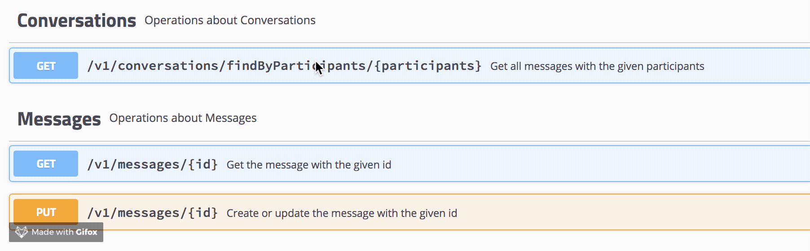

# Simple Messaging App API

A POC of a simple messaging App restful API built using Java (Spring framework).

Requirements:
- Java 8
- Docker

App Dependencies:
- Postgres

## Running locally

Tests can be run with `./gradlew test`.

```
docker-compose -f local-dev.yml up
./gradlew build && java -jar build/libs/gs-spring-boot-0.1.0.jar
```

Navigate to localhost:8080/swagger-ui.html, and explore there (or in curl or Postman).



### Todo

- User Controller
- Integration tests
- Checkstyle during build
- Metrics/monitoring
- Explore use of Kafka


