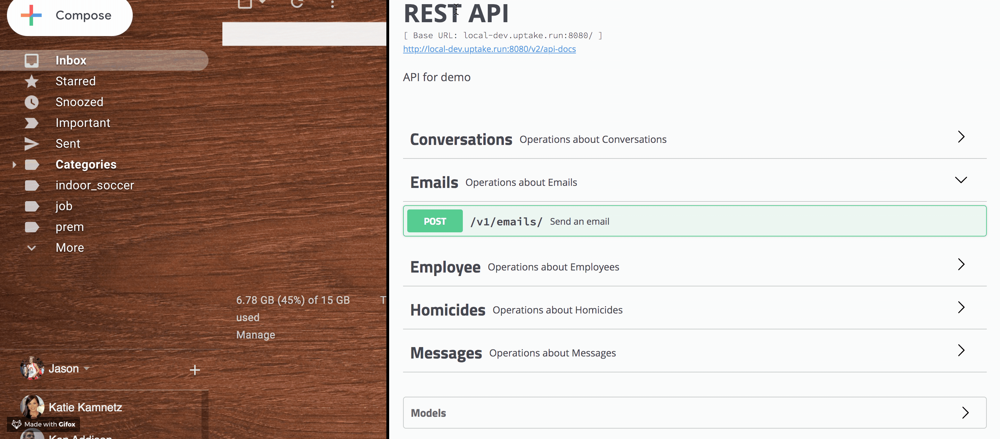

# Demo App API - Email Service

A simple email service using Java.

This project also contains unrelated side-project resources (United Nations homicide data, Chicago employee data).



Requirements:
- Java 11
- Docker
- IntelliJ recommended (run-configs provided)
- IntelliJ enable annotation processing (for Lombok)

App Dependencies:
- Postgres

## Environment Variables
The server must be configured with the following environment variables.

|Variable|Description|
|:------|:------|
|`MAILGUN_ENABLED`|Enable mailgun email service?, eg, `false` |
|`MAILGUN_API_KEY`|The apikey associated with the mailgun account, eg, `eb17ee59d22bf35fdead4xbera292rd1-9w4ea91f-bfz3l761` |
|`AWS_SES_ENABLED`|Enable AWS SES email service?, eg, `true` |
|`AWS_ACCESS_KEY_ID`|The access key of the AWS IAM account, eg, `BKEEEEYVC1NQJOGPARG` |
|`AWS_SECRET_ACCESS_KEY`|The access key secret of the AWS IAM account, eg, `Beb15ee59d21bf35fdead4xbera292r` |

## Running locally

Tests can be run with `./gradlew checkstyleMain checkstyleTest test`.

```
docker-compose -f local-dev.yml up
./gradlew build && java -jar build/libs/gs-spring-boot-0.1.0.jar
```

Alternatively, use the IntelliJ run configuration.

Navigate to localhost:8080/swagger-ui.html

## Todo:
- environment variables
- integration tests
- error logging
- CI/CD
- metrics/monitoring